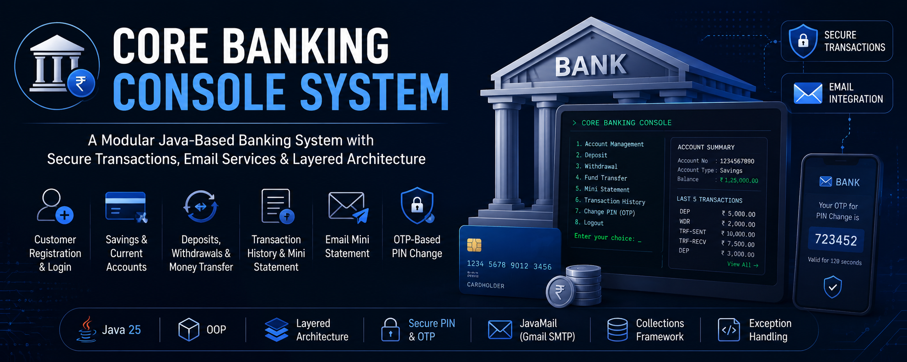

<p align="center">
  <a href="https://github.com/TanmayT134/Banking-Console-System">
    
  </a>
</p>

<p align="center">

# 🏦 Core Banking Console System

### A modular Java-based banking simulation built with Object-Oriented Programming, layered architecture, secure authentication, transaction management, and email integration.

</p>

<p align="center">


</p>

---

# 📖 Overview

**Core Banking Console System** is a Java console application designed to simulate essential banking operations through a structured and modular software architecture.

The system allows customers to register, authenticate, create bank accounts, perform financial transactions, view transaction history, securely change their PIN using email-based OTP verification, and receive mini statements through email.

The project focuses on applying core software engineering concepts including:

- Object-Oriented Programming
- Layered Architecture
- Repository Pattern
- Service-Oriented Design
- Java Collections
- Exception Handling
- Secure PIN Management
- Email Integration
- Transaction Processing
- Concurrency-Safe Money Transfers

The application separates responsibilities across **model**, **repository**, **service**, **UI**, **utility**, and **exception** layers, making the codebase easier to understand, maintain, test, and extend.

---

# ✨ Key Features

<table>
<tr>
<td width="50%" valign="top">

### 👤 Customer Management

- Customer registration
- Customer authentication
- Unique customer ID generation
- Email-based login
- Customer account management
- Secure logout functionality

</td>

<td width="50%" valign="top">

### 🏦 Bank Accounts

- Savings Account
- Current Account
- Unique account number generation
- Initial deposit support
- Multiple accounts per customer
- Account balance enquiry

</td>
</tr>

<tr>
<td width="50%" valign="top">

### 💳 Banking Transactions

- Cash deposit
- Cash withdrawal
- Account-to-account money transfer
- Balance enquiry
- Complete transaction history
- Last 5 transactions mini statement

</td>

<td width="50%" valign="top">

### 🔐 Security

- 4-digit PIN validation
- Hashed PIN storage
- Current PIN verification
- Email-based OTP verification
- OTP expiration handling
- Secure PIN change workflow

</td>
</tr>

<tr>
<td width="50%" valign="top">

### 📧 Email Services

- Gmail SMTP integration
- PIN change OTP delivery
- Email mini statements
- Account information in statements
- Transaction summary through email

</td>

<td width="50%" valign="top">

### ⚙️ Reliability

- Custom banking exceptions
- Input validation
- Transaction status tracking
- Deterministic account locking
- Thread-safe transfer execution
- Automated smoke testing

</td>
</tr>
</table>

---

# 🧠 System Architecture

The application follows a layered structure where responsibilities are separated between different components.

```text
┌─────────────────────────────────────────────┐
│                 User / CLI                  │
└──────────────────────┬──────────────────────┘
                       │
                       ▼
┌─────────────────────────────────────────────┐
│                   UI Layer                  │
│                                             │
│ MainMenu                                    │
│ AuthenticationMenu                          │
│ CustomerMenu                                │
│ AccountMenu                                 │
│ TransactionMenu                             │
└──────────────────────┬──────────────────────┘
                       │
                       ▼
┌─────────────────────────────────────────────┐
│                Service Layer                │
│                                             │
│ AuthenticationService                       │
│ AccountService                              │
│ TransactionService                          │
│ PinChangeService                            │
│ EmailMiniStatementService                   │
└───────────────┬─────────────────┬───────────┘
                │                 │
                ▼                 ▼
┌────────────────────────┐  ┌─────────────────┐
│    Repository Layer    │  │  Utility Layer  │
│                        │  │                 │
│ UserRepository         │  │ EmailUtil       │
│ AccountRepository      │  │ EmailConfig     │
│ TransactionRepository  │  │ PinUtil         │
└────────────┬───────────┘  │ OTPGenerator    │
             │              │ InputUtil       │
             ▼              │ ID Generators   │
┌────────────────────────┐  └─────────────────┘
│      Domain Models     │
│                        │
│ User                   │
│ BankAccount            │
│ SavingsAccount         │
│ CurrentAccount         │
│ Transaction            │
└────────────────────────┘
```

This separation keeps business logic independent from the console interface and improves maintainability.

---

# 🔄 Banking Workflow

```text
                    ┌──────────────────┐
                    │  Start Banking   │
                    │     System       │
                    └────────┬─────────┘
                             │
                             ▼
                    ┌──────────────────┐
                    │ Register / Login │
                    └────────┬─────────┘
                             │
                             ▼
                    ┌──────────────────┐
                    │Customer Dashboard│
                    └────────┬─────────┘
                             │
          ┌──────────────────┼───────────────────┐
          │                  │                   │
          ▼                  ▼                   ▼
   ┌─────────────┐    ┌─────────────┐     ┌─────────────┐
   │   Account   │    │ Transaction │     │  Security   │
   │ Management  │    │ Management  │     │  Services   │
   └──────┬──────┘    └──────┬──────┘     └──────┬──────┘
          │                  │                   │
          ▼                  ▼                   ▼
   Create Account        Deposit            Change PIN
   View Accounts         Withdraw           Generate OTP
   Check Balance         Transfer           Email OTP
                         History            Verify OTP
                         Mini Statement
                              │
                              ▼
                     ┌─────────────────┐
                     │ Email Statement │
                     │   (Optional)    │
                     └─────────────────┘
```

---

# 💰 Supported Account Types

The system currently supports two bank account types.

| Account Type | Description |
|---|---|
| 💰 **Savings Account** | Standard savings account for customer banking operations |
| 🏢 **Current Account** | Current account supporting the same core transaction workflow |

Both account types inherit from the common `BankAccount` model.

> **Note:** Fixed Deposit and Loan modules are intentionally not part of the current system.

---

# 💳 Transaction Management

The banking system supports the following transaction operations:

### Deposit

Customers can deposit money into their bank account.

The transaction is recorded as:

```text
DEPOSIT
```

### Withdrawal

Customers can withdraw funds from their account after balance and amount validation.

The transaction is recorded as:

```text
WITHDRAWAL
```

### Money Transfer

Customers can transfer money between accounts.

Two transaction records are generated:

```text
TRANSFER_SENT
TRANSFER_RECEIVED
```

This provides transaction history for both the sender and receiver.

---

# 🔒 Concurrency-Safe Money Transfers

Money transfers use **deterministic account locking**.

Before performing a transfer, the application determines the lock order using account numbers.

Conceptually:

```text
Sender Account
      │
      ▼
Compare Account Numbers
      │
      ▼
Lock Lower Account Number
      │
      ▼
Lock Higher Account Number
      │
      ▼
Validate Balance
      │
      ▼
Withdraw From Sender
      │
      ▼
Deposit Into Receiver
      │
      ▼
Record Both Transactions
```

Using a deterministic lock order helps prevent inconsistent lock ordering when multiple transfers are executed concurrently.

---

# 📊 Transaction History

Customers can retrieve the complete transaction history associated with an account.

Each transaction contains information such as:

- Transaction ID
- Account Number
- Transaction Type
- Amount
- Transaction Status
- Description
- Timestamp
- Related Account where applicable

Supported transaction types include:

```text
DEPOSIT
WITHDRAWAL
TRANSFER_SENT
TRANSFER_RECEIVED
```

---

# 🧾 Mini Statement

The system provides a mini statement containing the **5 most recent transactions** for an account.

The statement includes information such as:

```text
Customer Name
Customer ID
Account Number
Account Type
Registered Email

Last 5 Transactions

Transaction ID
Date / Time
Transaction Type
Amount
Status
Description

Current Balance
```

Customers can view their transaction information through the application and can also request a mini statement through their registered email.

---

# 📧 Email Mini Statement

The `EmailMiniStatementService` generates a formatted mini statement and sends it to the customer's registered email address.

Before sending the statement, the system verifies that the selected account belongs to the authenticated customer.

The generated email contains:

- Customer name
- Customer ID
- Account number
- Account type
- Registered email
- Last 5 transactions
- Current account balance

---

# 🔐 Secure PIN Management

PIN management is handled through dedicated validation and hashing utilities.

### PIN Requirements

A valid PIN must:

```text
Contain exactly 4 digits
```

The system does not rely on storing the customer's PIN directly.

PIN-related functionality includes:

- PIN format validation
- PIN hashing
- PIN verification
- Current PIN verification
- New PIN validation
- Prevention of reusing the current PIN

---

# 🔑 OTP-Based PIN Change

Changing the banking PIN requires multiple verification steps.

```text
Customer Requests PIN Change
            │
            ▼
Generate OTP
            │
            ▼
Store OTP Temporarily
            │
            ▼
Send OTP to Registered Email
            │
            ▼
Customer Enters Current PIN
            │
            ▼
Customer Enters OTP
            │
            ▼
Validate OTP + Expiration
            │
            ▼
Validate New PIN
            │
            ▼
Hash & Update PIN
```

The OTP is valid for:

```text
120 seconds
```

Expired or incorrect OTPs are rejected.

---

# 🛡️ Authentication & Security

The project includes several security-focused practices.

### PIN Protection

Customer PINs are processed through the dedicated `PinUtil` utility rather than being stored directly as plain text.

### OTP Verification

Sensitive PIN changes require verification through an OTP delivered to the registered email address.

### OTP Expiration

Generated OTPs automatically become invalid after **120 seconds**.

### Account Ownership Validation

Email mini statements verify that the requested account belongs to the currently authenticated customer.

### Configuration Protection

Email credentials are stored outside the Java source code using:

```text
config/email.properties
```

The real configuration file is excluded through `.gitignore`.

---

# ⚠️ Exception Handling

The system defines custom exceptions for banking-specific error scenarios.

```text
BankingException
│
├── AuthenticationException
├── AccountNotFoundException
├── InvalidAmountException
└── TransferException
```

These exceptions help separate banking errors from general application errors and provide clearer error handling throughout the service layer.

---

# 🆔 Automatic ID Generation

Dedicated utility classes generate identifiers required throughout the system.

| Utility | Purpose |
|---|---|
| `UserIdGenerator` | Generates unique customer IDs |
| `AccountNumberGenerator` | Generates bank account numbers |
| `TransactionIdGenerator` | Generates transaction IDs |
| `OTPGenerator` | Generates OTP codes |

This keeps identifier generation separate from business logic.

---

# 🛠️ Technology Stack

| Category | Technology |
|---|---|
| **Programming Language** | Java |
| **Recommended JDK** | Java 25 |
| **Application Type** | Console Application |
| **Architecture** | Layered Architecture |
| **Programming Paradigm** | Object-Oriented Programming |
| **Collections** | Java Collections Framework |
| **Email Integration** | JavaMail |
| **SMTP Provider** | Gmail SMTP |
| **Security** | PIN Hashing + Email OTP |
| **Concurrency** | Java Synchronization |
| **Testing** | Custom Smoke Test |
| **Build / Execution** | Windows Batch Scripts |
| **Version Control** | Git & GitHub |

---

# 🧩 Java Concepts Demonstrated

This project demonstrates practical use of several important Java concepts:

- Classes and Objects
- Encapsulation
- Inheritance
- Abstraction
- Polymorphism
- Collections
- Enums
- Exception Handling
- Custom Exceptions
- Utility Classes
- Repository Pattern
- Service Layer Pattern
- Synchronization
- Immutable records
- `Optional`
- `BigDecimal`
- Date and Time API
- Email Integration
- Secure credential configuration

---

# 📂 Project Structure

```text
BankingConsoleSystem/
│
├── config/
│   ├── email.properties.example
│   └── email.properties              # Local only - ignored by Git
│
├── lib/
│   ├── javax.mail-1.6.2.jar
│   ├── activation-1.1.1.jar
│   └── README.txt
│
├── src/
│   └── com/
│       └── tanmay/
│           └── corebanking/
│               │
│               ├── Main.java
│               │
│               ├── enums/
│               │   ├── AccountType.java
│               │   ├── TransactionStatus.java
│               │   └── TransactionType.java
│               │
│               ├── exception/
│               │   ├── AccountNotFoundException.java
│               │   ├── AuthenticationException.java
│               │   ├── BankingException.java
│               │   ├── InvalidAmountException.java
│               │   └── TransferException.java
│               │
│               ├── model/
│               │   ├── BankAccount.java
│               │   ├── CurrentAccount.java
│               │   ├── SavingsAccount.java
│               │   ├── Transaction.java
│               │   └── User.java
│               │
│               ├── repository/
│               │   ├── AccountRepository.java
│               │   ├── TransactionRepository.java
│               │   └── UserRepository.java
│               │
│               ├── service/
│               │   ├── AccountService.java
│               │   ├── AuthenticationService.java
│               │   ├── EmailMiniStatementService.java
│               │   ├── PinChangeService.java
│               │   └── TransactionService.java
│               │
│               ├── test/
│               │   └── CoreBankingSmokeTest.java
│               │
│               ├── ui/
│               │   ├── AccountMenu.java
│               │   ├── AuthenticationMenu.java
│               │   ├── CustomerMenu.java
│               │   ├── MainMenu.java
│               │   └── TransactionMenu.java
│               │
│               └── util/
│                   ├── AccountNumberGenerator.java
│                   ├── EmailConfig.java
│                   ├── EmailUtil.java
│                   ├── InputUtil.java
│                   ├── OTPGenerator.java
│                   ├── PinUtil.java
│                   ├── PinValidator.java
│                   ├── TransactionIdGenerator.java
│                   └── UserIdGenerator.java
│
├── .gitignore
├── compile.bat
├── run.bat
├── test.bat
└── README.md
```

---

# 📁 Package Overview

| Package | Responsibility |
|---|---|
| `model` | Core banking domain objects |
| `repository` | Stores and retrieves application data |
| `service` | Contains banking business logic |
| `ui` | Handles console menus and user interaction |
| `util` | Shared utilities and generators |
| `exception` | Banking-specific exception classes |
| `enums` | Account and transaction constants |
| `test` | Application smoke testing |

---

# ⚙️ Installation & Setup

## 1️⃣ Clone the Repository

```bash
git clone https://github.com/TanmayT134/Banking-Console-System.git
```

```bash
cd Banking-Console-System
```

---

## 2️⃣ Install Java

Install **Java 25** or another compatible modern JDK.

Verify the installation:

```bash
java -version
```

and:

```bash
javac -version
```

---

## 3️⃣ Add Required Libraries

Place the following JAR files inside the `lib/` directory:

```text
javax.mail-1.6.2.jar
activation-1.1.1.jar
```

The resulting directory should look like:

```text
lib/
├── javax.mail-1.6.2.jar
└── activation-1.1.1.jar
```

---

# 📧 Email Configuration

Email functionality is used for:

- PIN change OTP verification
- Email mini statements

The repository contains:

```text
config/email.properties.example
```

Create your local configuration file:

```text
config/email.properties
```

Then add:

```properties
BANKING_EMAIL=your-gmail-address@gmail.com
BANKING_EMAIL_APP_PASSWORD=your-16-character-google-app-password
```

Use a **Google App Password**, not your normal Gmail account password.

---

# 🔐 Important Security Notice

Never commit:

```text
config/email.properties
```

to GitHub.

The project `.gitignore` already contains:

```gitignore
out/
config/email.properties
*.class
```

This prevents the local email credentials and generated Java class files from being tracked.

### Never expose:

- Gmail passwords
- Google App Passwords
- SMTP credentials
- Private authentication credentials

The repository should contain only:

```text
email.properties.example
```

with placeholder values.

---

# 📩 Gmail SMTP Configuration

The email functionality uses Gmail SMTP over SSL.

```text
SMTP Server : smtp.gmail.com
SSL Port    : 465
```

The project also uses targeted JavaMail trust configuration for:

```text
smtp.gmail.com
```

This helps in environments where antivirus software performs SMTP/TLS inspection and presents a locally generated certificate.

---

# 🛡️ Avast / TLS Note

Some antivirus products, including Avast Web/Mail Shield configurations, may inspect encrypted SMTP connections.

This can cause JavaMail certificate validation problems when the antivirus presents its own locally generated certificate for `smtp.gmail.com`.

The project uses:

```properties
mail.smtp.ssl.trust=smtp.gmail.com
```

together with Gmail SMTP SSL on port:

```text
465
```

This configuration is intentionally targeted at Gmail SMTP rather than disabling antivirus protection globally.

---

# ▶️ Running the Application

On Windows, run:

```bash
run.bat
```

The script first compiles the project and then starts:

```text
com.tanmay.corebanking.Main
```

Internally, `run.bat` executes the application with the required JavaMail dependencies on the classpath.

---

# 🔨 Compiling the Project

To compile the application without immediately running it:

```bash
compile.bat
```

Compiled classes are generated inside:

```text
out/
```

The `out/` directory is ignored by Git.

---

# 🧪 Testing

The project includes a smoke test:

```text
CoreBankingSmokeTest.java
```

Run it using:

```bash
test.bat
```

The script:

1. Compiles the project
2. Loads the required libraries
3. Runs the banking smoke test

This provides a quick way to verify the core application behavior after making changes.

---

# 🚀 Usage

After starting the application:

### Step 1 — Register or Login

Create a new customer account or authenticate using an existing account.

### Step 2 — Manage Accounts

Create and access:

- Savings Accounts
- Current Accounts

### Step 3 — Perform Transactions

Use the transaction system to:

- Deposit money
- Withdraw money
- Transfer money
- Check account balance

### Step 4 — Review Activity

Customers can access:

- Complete transaction history
- Mini statement containing the last 5 transactions

### Step 5 — Use Email Services

Customers can:

- Receive OTPs for PIN changes
- Receive mini statements through registered email

### Step 6 — Logout

Securely end the authenticated banking session.

---

# 🧱 Design Principles

The project is structured around separation of concerns.

### Model Layer

Represents banking entities such as customers, accounts, and transactions.

### Repository Layer

Handles storage and retrieval of:

- Users
- Accounts
- Transactions

### Service Layer

Contains business logic for:

- Authentication
- Account management
- Transactions
- PIN changes
- Email statements

### UI Layer

Handles:

- Console menus
- User interaction
- Navigation between banking operations

### Utility Layer

Provides reusable functionality including:

- PIN handling
- OTP generation
- Email configuration
- Email delivery
- Input processing
- ID generation

This structure prevents the application's business logic from becoming tightly coupled with the console interface.

---

# 🎯 Learning Objectives

This project was developed to strengthen practical understanding of:

- Advanced Java programming
- Object-Oriented Programming
- Layered software architecture
- Banking domain modelling
- Secure authentication flows
- Repository and service patterns
- Java Collections
- Custom exception handling
- Email integration using JavaMail
- Concurrency and synchronization
- Transaction management
- Input validation
- Git and GitHub version control

---

# 🚧 Current Scope

The current version focuses on the core banking workflow:

```text
Authentication
      +
Account Management
      +
Transactions
      +
Transaction History
      +
Security
      +
Email Services
```

The following modules are intentionally excluded from the current system:

```text
❌ Fixed Deposit
❌ Loan Management
```

This keeps the project focused on implementing the core banking workflow cleanly.

---

# 🔮 Future Enhancements

Potential future improvements include:

- 🗄️ Database persistence using JDBC and MySQL
- 👨‍💼 Administrative banking dashboard
- 📊 Advanced transaction analytics
- 🧾 Downloadable account statements
- 🔍 Transaction search and filtering
- 💳 Beneficiary management
- 🔐 Enhanced authentication mechanisms
- 📝 Audit logging
- 🧪 Expanded automated testing
- 🌐 REST API layer
- 🖥️ Web-based banking interface
- 🐳 Dockerized deployment

---

# ⚠️ Disclaimer

This project is an **educational banking simulation** created for learning and portfolio purposes.

It is **not a production banking system** and should not be used for real financial transactions or storage of real banking credentials.

---

# 🤝 Contributing

Suggestions and improvements are welcome.

To contribute:

1. Fork the repository
2. Create a new feature branch
3. Make your changes
4. Commit the changes
5. Push the branch
6. Open a Pull Request

---

# 👨‍💻 Developer

**Tanmay Tawade**

Electronics & Telecommunication Engineer

**Java • Software Engineering • Full-Stack Development • Artificial Intelligence**

### Connect

<p>

<a href="https://github.com/TanmayT134">

</a>

<a href="https://www.linkedin.com/in/tanmay-tawade-995829344/">

</a>

<a href="https://portfolio-tanmay-tawade.vercel.app/">

</a>

<a href="https://dev.to/tanmayt134">

</a>

</p>

---

# ⭐ Support

If you find the project useful or interesting:

- ⭐ Star the repository
- 🍴 Fork the project
- 💬 Share feedback or suggestions
- 🛠️ Contribute improvements
- 🤝 Connect for collaboration

---

<p align="center">

<strong>Core Banking Console System</strong>

<br>

A practical implementation of banking operations, secure authentication, transaction processing, and modular Java architecture.

<br><br>

Made with ❤️ using <strong>Java</strong> by <strong>Tanmay Tawade</strong>

</p>